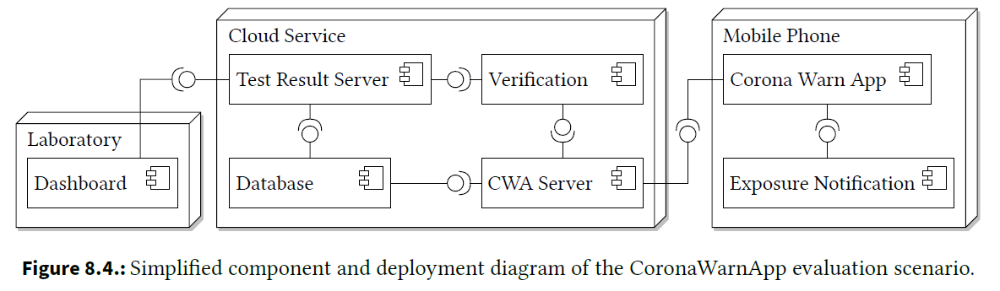

 
    <h3 align="center"> 
    Evaluation Scenario: Corona Warn App</h3>

&nbsp;

## ABUNAI - Evaluation Scenario: Corona Warn App

The Corona Warn App is one of six scenarios used in the initial evaluation of the ABUNAI approach to uncertainty-aware confidentiality analysis. Please see the following table for an overview of the criteria of all evaluation scenarios:

| Name                | # Component | # SEFF | # TFG | # Vertex | # Uncertainty | # Violation |
|---------------------|-------------:|--------:|-------:|----------:|----------------:|--------------:|
| [TravelPlanner](https://github.com/DataFlowAnalysis/DataFlowAnalysis)       | 7           | 9      | 2     | 42       | 1              | 1            |
| [DistanceTracker](https://github.com/DataFlowAnalysis/DataFlowAnalysis)     | 8           | 10     | 1     | 29       | 1              | 1            |
| [OnlineShop](https://github.com/abunai-dev/EvaluationScenario-OnlineShop)          | 2           | 6      | 3     | 44       | 4              | 24           |
| **[CoronaWarnApp](https://github.com/abunai-dev/EvaluationScenario-CoronaWarnApp)**       | **21**          | **58**     | **14**    | **687**      | **9**              | **163**          |
| [MobilityAsAService](https://github.com/abunai-dev/EvaluationScenario-MaaS)  | 18          | 49     | 8     | 200      | 5              | 6            |
| [JPlag](https://github.com/abunai-dev/EvaluationScenario-JPlag)               | 3           | 5      | 3     | 65       | 4              | 26           |

For further information, please see the [dissertation](https://doi.org/10.5445/IR/1000178700) *Chapter 8* on the evaluation scenarios. There, the following figure summarizes the architecture of this evaluation scenario:

## Overview

This repository contains [Palladio](https://www.palladio-simulator.com/) software architecture models based on the German [Corona Warn App](https://www.coronawarn.app/en/). This app represents a large enterprise system of systems that has been commissioned by the German government, developed by SAP and Deutsche Telekom during the COVID-19 pandemic, and downloaded more than 48 million times. The contact tracing app exchanges keys between users via Bluetooth and handles highly sensitive data like COVID-19 test results.

We modeled all important functionality of the Corona Warn App, e.g., the exchange, download, and upload of keys, checking COVID-19 test results, requesting vaccination certificates, or gathering analysis data. The models in this repository are primarily used to evaluate confidentiality analysis and [Uncertainty Impact Analysis](https://github.com/abunai-dev/UncertaintyImpactAnalysis). However, other use cases for software architecture research evaluation are imaginable.

Please refer to the original publication: S. Hahner, R. Heinrich, and R. Reussner, "Architecture based Uncertainty Impact Analysis to Ensure Confidentiality", in *18th Symposium on Software Engineering for Adaptive and Self-Managing Systems (SEAMS)*, IEEE/ACM, 2023, doi: [10.1109/SEAMS59076.2023.00026](https://doi.org/10.1109/SEAMS59076.2023.00026)

The primary sources of the modeled information are:

- The [official documentation](https://github.com/corona-warn-app/cwa-documentation/blob/main/solution_architecture.md) of the open-source Corona Warn App
- Available [documentation](https://health.ec.europa.eu/system/files/2021-04/digital-green-certificates_dt-specifications_en_0.pdf) about digital COVID-19 certificates, also known as digital green certificates
- Documentation about the interfaces of the [CovPass Issuer](https://github.com/Digitaler-Impfnachweis/documentation)

## Branches

There are multiple branches that reflect different versions of the case study:

- The `main` branch contains the main case study with all Palladio models and additionally modeled confidentiality information
- The `uncertainty-impact-scenarios` branch contains 4 scenarios that have been used to evaluate the [Uncertainty Impact Analysis](https://github.com/abunai-dev/UncertaintyImpactAnalysis)

## Diagrams

Please use [Palladio](https://www.palladio-simulator.com/) to open the model files. To use the models in confidentiality analysis or uncertainty impact analysis, see the [installation guide](https://github.com/abunai-dev/UncertaintyImpactAnalysis).

In the following, we show the repository diagram and the allocation diagram. Click the images for a full size view.

### Repository diagram

### Allocation diagram

